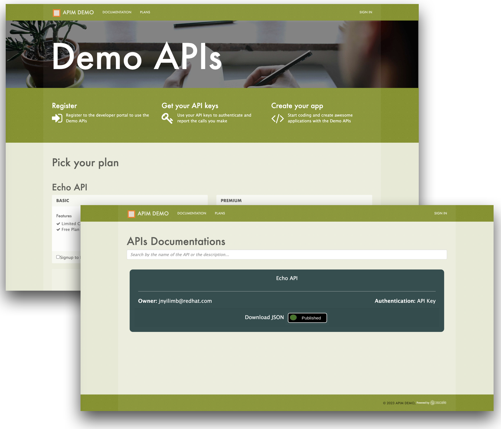

# 3scale Developer Portal Customizations

The [Demo02_sign-up_flows](./Demo02_sign-up_flows) folder is used for customizing the 3scale Developer Portal.

In the 3scale CMS:
1. Edit the `main layout`_` with [00-main_layout.liquid](./Demo02_sign-up_flows/00-main_layout.liquid) content
2. Edit the `homepage` with [01-homepage.liquid](./Demo02_sign-up_flows/01-homepage.liquid) content
3. Create a `partial` called `single_app_signup_form` with [02-single_app_signup_form-partial.liquid](./Demo02_sign-up_flows/02-single_app_signup_form-partial.liquid)
4. Create a `partial` called `multiple_app_signup_form` with [03-multiple_app_signup_form-partial.liquid](./Demo02_sign-up_flows/03-multiple_app_signup_form-partial.liquid)
5. Edit the `documentation` page with the [06-documentation.html](./06-documentation.html) content
5. Upload the following artifacts by preserving the `Root` structure:
    - Create a `/css/doc.css` CSS page with the [Root/css/doc.css](./Demo02_sign-up_flows/Root/css/doc.css) content. :warning: Make sure the `Content Type : text/css`
    - Create a `javascript/doc.js` Javascript page with the [Root/javascripts/doc.js](./Demo02_sign-up_flows/Root/javascripts/doc.js) content. :warning: Make sure the `Content Type : text/javascript`
    - Upload all the images under the [Root/images](./Demo02_sign-up_flows/Root/images) folder in the `images` section. :warning: Make sure the `Path : /images/<name of the file>`

You should expect to have a customized Developer Portal similar to the screenshot below.

