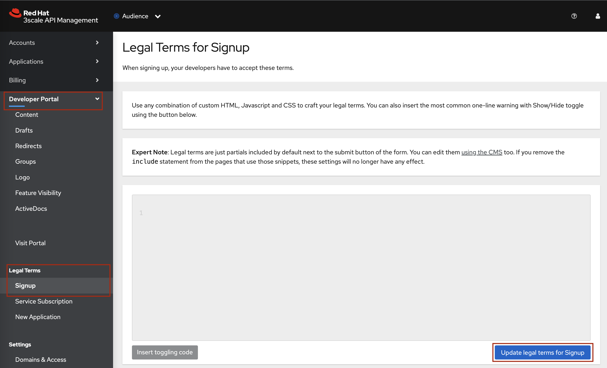
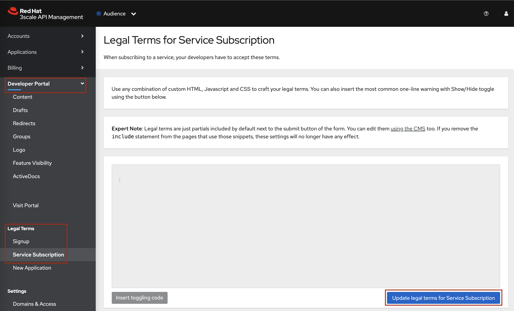
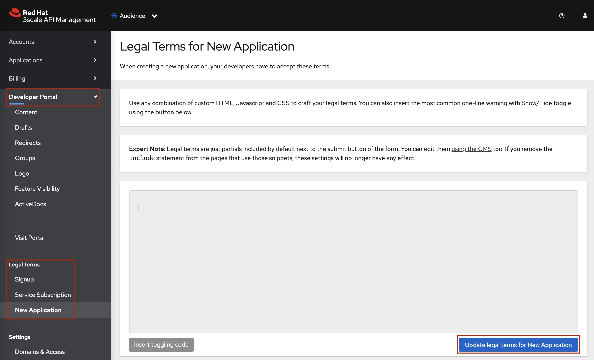
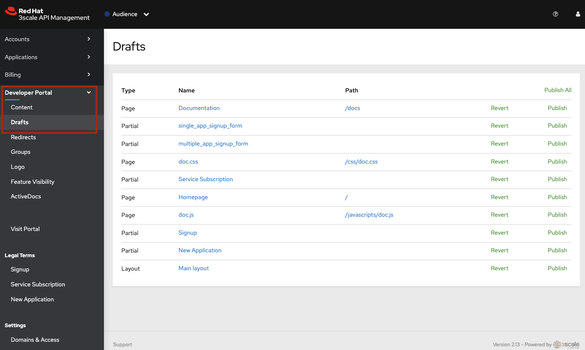

# 3scale Developer Portal Customizations

The [Demo02_sign-up_flows](./Demo02_sign-up_flows) folder is used for customizing the 3scale Developer Portal.

In the 3scale CMS:
1. Edit the `main layout` with [00-main_layout.liquid](./Demo02_sign-up_flows/00-main_layout.liquid) content
2. Edit the `homepage` with [01-homepage.liquid](./Demo02_sign-up_flows/01-homepage.liquid) content
3. Create a `partial` called `single_app_signup_form` with [02-single_app_signup_form-partial.liquid](./Demo02_sign-up_flows/02-single_app_signup_form-partial.liquid)
4. Create a `partial` called `multiple_app_signup_form` with [03-multiple_app_signup_form-partial.liquid](./Demo02_sign-up_flows/03-multiple_app_signup_form-partial.liquid)
5. Edit the `documentation` page with the [06-documentation.html](./06-documentation.html) content
6. Upload the following artifacts by preserving the `Root` structure:
    - Create a `/css/doc.css` CSS page with the [Root/css/doc.css](./Demo02_sign-up_flows/Root/css/doc.css) content. :warning: Make sure the `Content Type = text/css`
    - Create a `/javascripts/doc.js` Javascript page with the [Root/javascripts/doc.js](./Demo02_sign-up_flows/Root/javascripts/doc.js) content. :warning: Make sure the `Content Type = text/javascript`
    - Upload all the images under the [Root/images](./Demo02_sign-up_flows/Root/images) folder in the `images` section. :warning: Make sure the `Path = /images/<name of the file>`
7. Configure the legal terms:
    - **Legal Terms for Signup**
        1. Go to the _Developer Portal -> Legal Terms -> Signup_ panel in the 3scale Admin Portal.

            
            
        2. Paste the content of [07-legalterms_signup.html](./05-legalterms_signup.html) and click on the `Update legal terms for Signup` button
    - **Legal Terms for Service Subscription**
        1. Go to the _Developer Portal -> Legal Terms -> Service Subscription_ panel in the 3scale Admin Portal.

            
            
        2. Paste the content of [08-legalterms_service-subscription.html](./06-legalterms_service-subscription.html) and click on the `Update legal terms for Service Subscription` button
    - **Legal Terms for New Application**
        1. Go to the _Developer Portal -> Legal Terms -> New Application_ panel in the 3scale Admin Portal.

            
            
        2. Paste the content of [09-legalterms_new-application.html](./07-legalterms_new-application.html) and click on the `Update legal terms for New Application` button
8. Make sure you have published all the assets, if any, listed in the `Drafts` section of the 3scale CMS. For instance, click on the `Publish All` link as show below:

    

You should expect to have a customized Developer Portal similar to the screenshot below.

